# Provisioning DEVOPS on OpenShift using Helm in 5 steps, from zero to hero
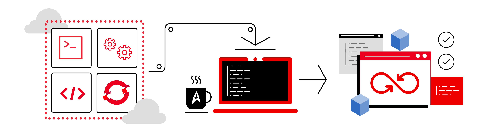

Let's see how to provision a complete environment DEVOPS with Cloud Native Pipeline applying the best practices and using the package manager for Kubernetes, the [Helm](https://helm.sh). The idea is to apply on only 5 simple steps for creating our DEVOPS environment with helm commands, after this we'll show you how to execute this solution with a real application through a successful git branching model, also known as [gitflow](https://nvie.com/posts/a-successful-git-branching-model). 

This solution will provision:
- 4 Namespaces, 1 to cicd (infra tools), development, staging and production (app's environments)
- OpenShift Pipelines (Tekton) for build the app image in each git commit
- OpenShift GitOps (ArgoCD) for deliver the app in OpenShift cluster
- Gitea git server (user/password: gitea/devops)
- Sonatype Nexus (user/password: admin/admin123)
- SonarQube (user/password: admin/admin)
- This solution isn't applicable in all use cases, you must adjust it for your needs. For example, tag or versioning strategy, adding apps with separation workspaces, hiding secrets and so on, are not covered in this article. 

## Prerequisites:

* OpenShift Platform 4.10+ and user cluster admin
* OpenShift Pipelines [Tekton]
* OpenShift Gitops [ArgoCD]
* OpenShift oc client
* Helm client
* Git client


## Steps

Next, we present the sequence of steps to provision the DEVOPS environment with helm.

### 1. Installing OpenShift GitOps 
Let's start installing OpenShift GitOps ArgoCD in the cicd namespace. Add the [redhat-cop](https://www.redhat.com/en/blog/communities-practice-straight-open-source) [helm charts](https://github.com/redhat-cop/helm-charts) repository by running the commands below.

```bash
# add the redhat-cop repository
helm repo add redhat-cop https://redhat-cop.github.io/helm-charts
# having added redhat-cop helm repository
helm upgrade --install argocd redhat-cop/gitops-operator --set namespaces[0]=cicd --create-namespace --namespace cicd
```

Confirm that OpenShift GitOps Operator has been successfully installed.
| 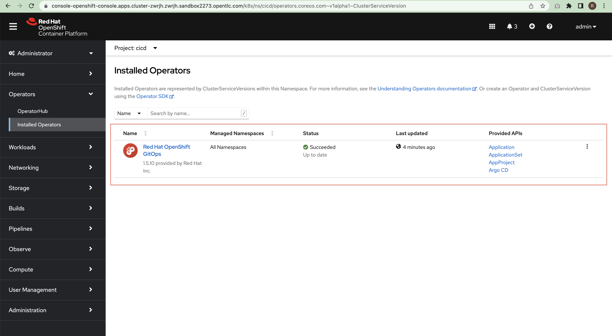 |
|-| 

### 2. Installing SonarQube
Run the command below to install SonarQube.

```bash
helm upgrade --install sonar redhat-cop/sonarqube -n cicd
```

Make sure if SonarQube is running through the Ready column where the value must be 1/1.
| 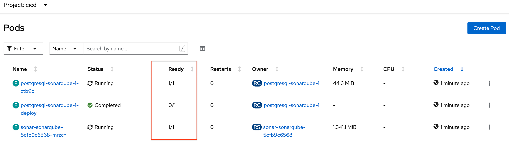 |
|-| 

Change Sonarqube password from admin/admin to admin/admin123.
| 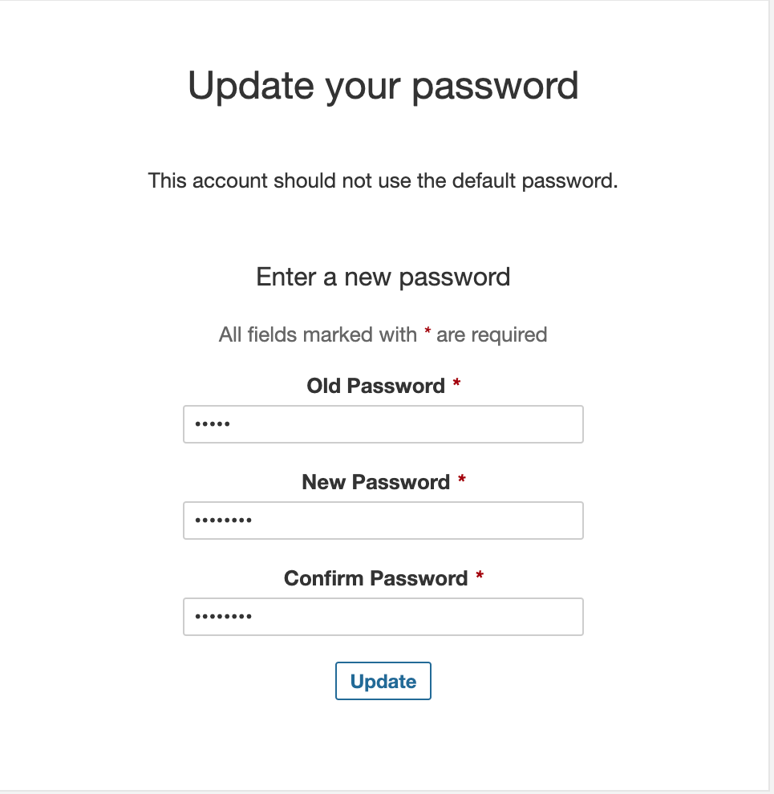 |
|-| 


Adjust Sonar for access without authentication.
Uncheck in Administration / Security / Force user authentication, as shown in the image below.

| 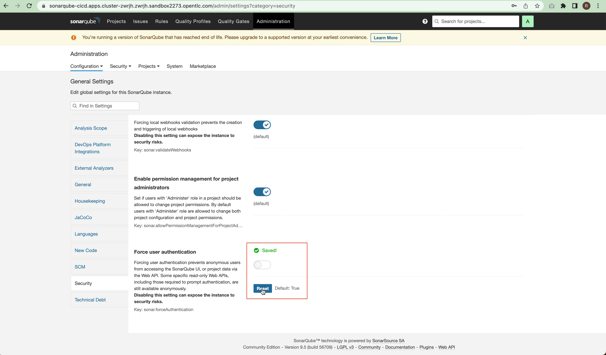 |
|-| 

### 3. Installing Nexus
Run the command below to install the Nexus Sonatype.
 
```bash
helm upgrade --install nexus redhat-cop/sonatype-nexus -n cicd
```

Check if Nexus is ok through the Ready column or accessing the application.  The default user/password is admin/admin123.
| 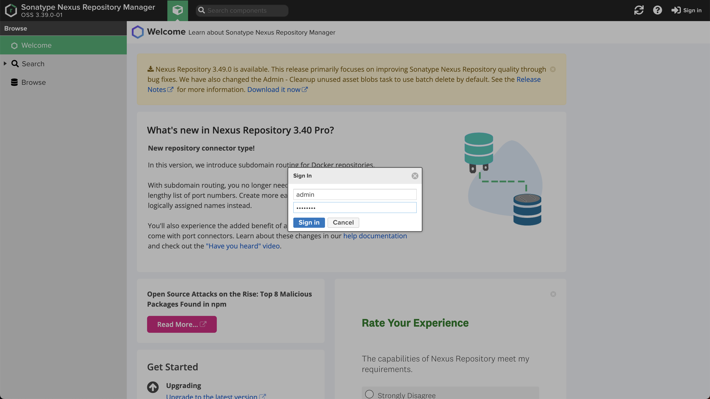 |
|-|

### 4. Installing Gitea 
In this step we're going to install a gitea server, first we need to define the "cluster" variable with the domain part of our cluster. This variable is used to create the gitea server route and will be used in the next step. 

For example, my cluster url is https://console-openshift-console.apps.cluster-mqh7n.mqh7n.sandbox2145.opentlc.com, so my "cluster" variable was defined as below. This is an important point, so adjust your cluster variable. 

Finally, run the command to install the gitea server.

```bash
cluster=apps.cluster-mqh7n.mqh7n.sandbox2145.opentlc.com
helm upgrade --install --repo=https://redhat-cop.github.io/helm-charts gitea gitea --set db.password=openshift --set hostname=gitea-cicd.$cluster -n cicd
```

Wait a moment and make sure if Gitea is running. 

### 5. Installing OpenShift Pipeline and so on

Run the next commands to install the OpenShift Pipeline - Tekton.

```bash
oc project cicd
oc project cicd
git clone https://github.com/ricardoaraujo75/devops-ocp-helm.git
oc apply -f devops-ocp-helm/templates/operator-pipeline/openshift-pipelines-sub.yaml

```

Wait finish in Operators / Installed Operators and confirm that OpenShift Pipeline Operator has been successfully installed.
| 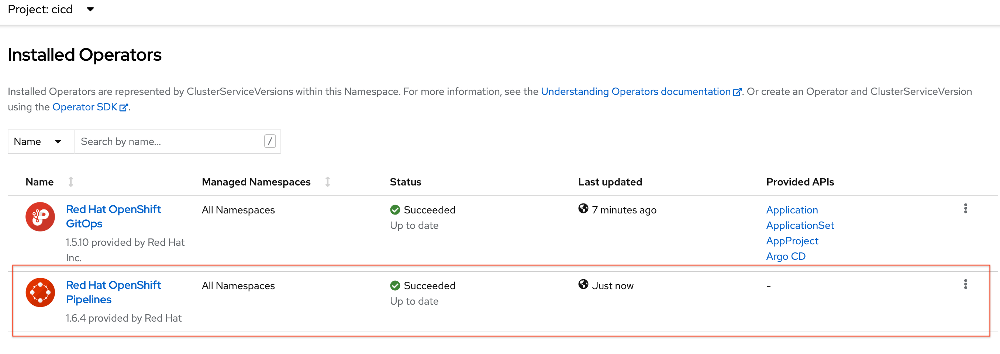 |
|-| 

Now is the time of all our strategy of DEVOPS, creating namespaces, pipeline, tasks, triggers, pvc, populate gitea repository, webhook, argocd apps etc. The last commands apply the policy to allow the pipeline to manage the namespaces for creating resources.

```bash
helm --set pipeline.gitea.host=gitea-cicd.$cluster --set cluster=$cluster template -f devops-ocp-helm/values.yaml devops-ocp-helm  | oc apply -f-
oc policy add-role-to-user edit system:serviceaccount:cicd:pipeline -n dev
oc policy add-role-to-user edit system:serviceaccount:cicd:pipeline -n sta
oc policy add-role-to-user edit system:serviceaccount:cicd:pipeline -n prod
```

Confirm that the Operator Pipeline, namespaces, pipeline object, tasks, triggers, pvc, webhooks, argocd app were created correctly.

Ready!

Congratulations, you've created a complete DEVOPS environment for Cloud Native Pipeline on OpenShift using the 5 steps above with helm commands, the proposal should look like the following image.

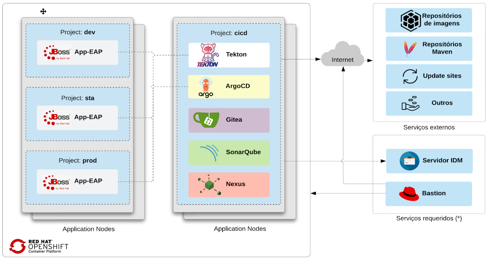

Right now, let's run the pipeline to confirm that everything is fine.

Before running, let's talk about the responsibility of the CI and CD. More information in CI/CD [article](https://github.com/siamaksade/openshift-cicd-demo).

#### Continuous Integration - CI

On each push to the devops-ocp-app git repository on the Gitea server, the following steps are performed in the Pipeline:
- The webhook configured in gitea triggers the start of the pipeline;
- The code is cloned from the Gitea server and the build is performed;
- Unit tests can be run and in parallel the code is analyzed by SonarQube for anti-patterns, and a dependency report is generated;
- The application is packaged as a WAR and released to the Sonatype Nexus artifact repository;
- A container image is created in the DEV or STA environment, depending on the branch, pushed to the OpenShift internal registry and tagged with app-eap:latest;
- Kubernetes manifests are updated in the Git config repository with the image digest that was created in the pipeline;
- A pull-request is created in the config repository to merge the image summary update into the PROD environment, this step is only performed for the STA environment.

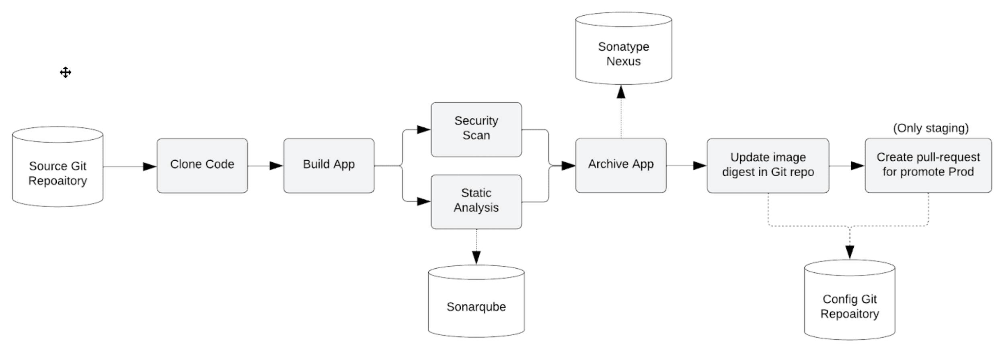

#### Continuous Delivered - CD

Argo CD continuously monitors settings stored in the Git repository and uses Kustomize to override environment-specific settings when deploying the application to DEV, STA, and PROD environments.

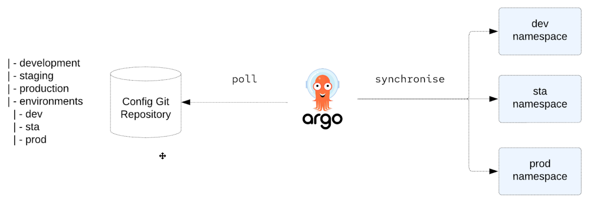


#### Pipeline execution

The objective is to create a Pipeline responsible for deploying the application in the development and staging environments, for production there will be a manual approval and it will be made available through a pull request in the GitOps configuration repository.

It contains the main steps of a software continuous integration process.

<u>Development Pipeline</u>
A single Pipeline serves both development and staging environments. As we are using gitflow, the control of which environment will be executed is in charge of the branch that starts the process -> ex.  branch develop for development and release for staging.
For development, the Pull Request promotion task is not performed.

The next command clones the app repository from gitea server and creates a new branch called develop, then push to origin develop, so the webhook configured starts the pipeline for develop environment.  

```bash
git clone https://gitea-cicd.apps.$cluster/gitea/devops-ocp-app.git 
cd devops-ocp-app
git checkout -b develop
# User and password gitea/devops
git push -u origin develop

```

|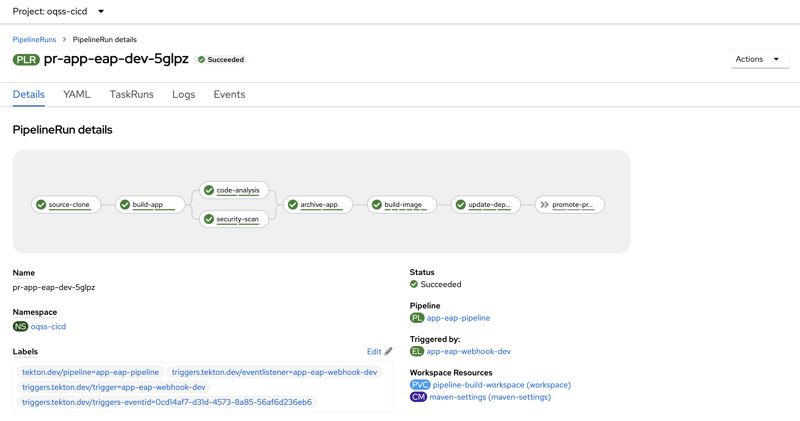|
|-|

<u>Staging Pipeline</u>
For this environment, all Tasks are performed, including the promotion of the Pull Request to promote the image to the production environment.

```bash
git checkout -b release
git push -u origin release
```

|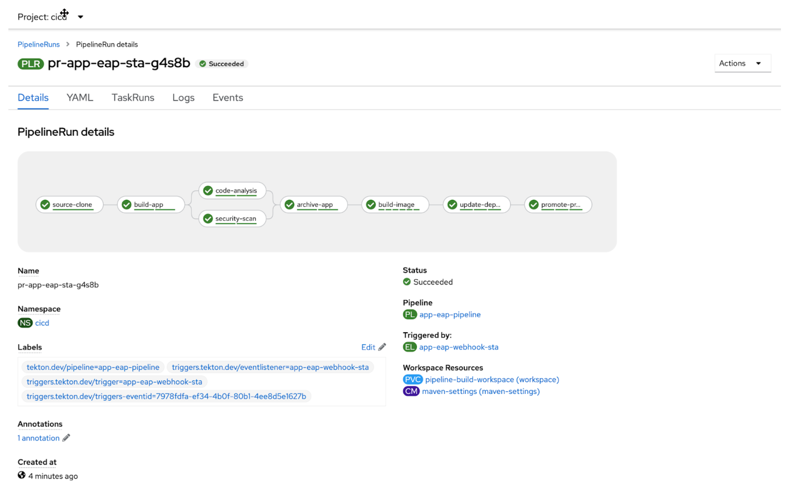|
|-|

|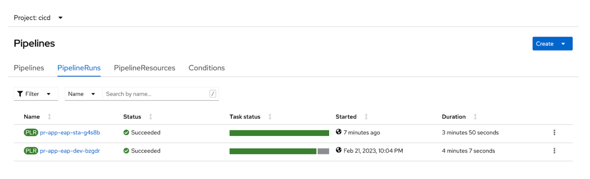|
|-|

<u>Production</u> 
To promote application to the production environment, go to Gitea, access the configuration repository (devops-ocp-app-config), in the pull request tab and accept the pull request generated by the Staging Pipeline. In this way, when performing the merge, the deployment will be performed in the production environment by ArgoCD.

|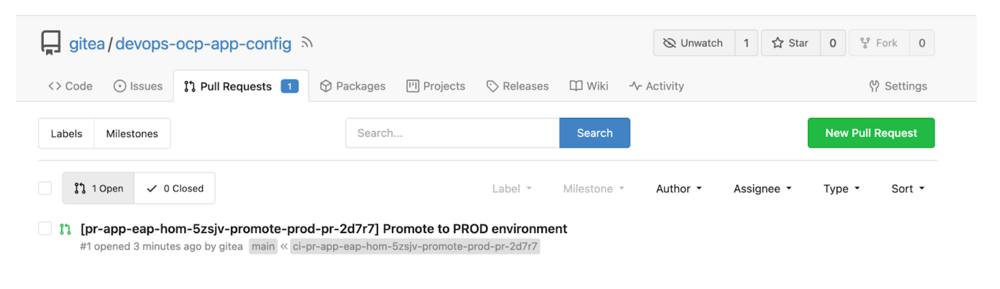|
|-|

Application running on the cluster.

|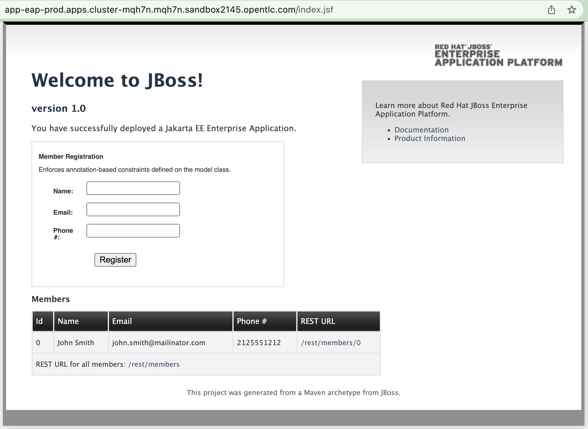|
|-|

Applications in the ArgoCD.

|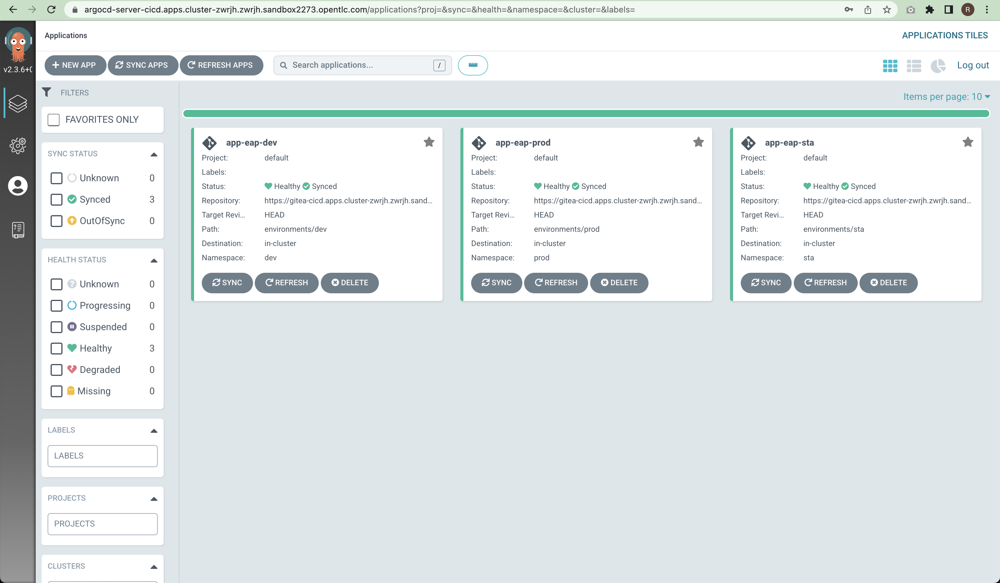|
|-|

## Conclusion
This solution helps you to have a simple and fast environment for DEVOPS with Cloud Native Pipeline and GitOps, of course there aren't tricks here, so it was necessary to use examples, create scripts, tests etc. However, once created you've a model replicable and easy to use. That's the magic of automation.

Feel free to contact me for suggestions, comments or help.


